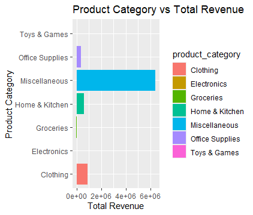
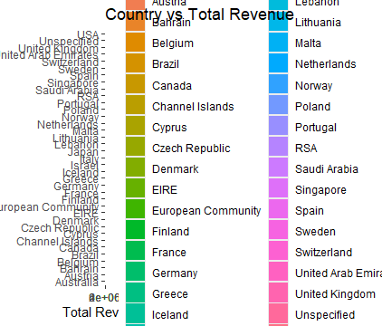
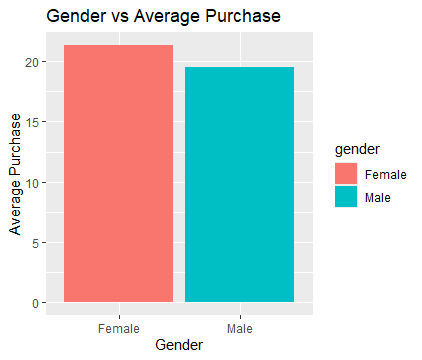
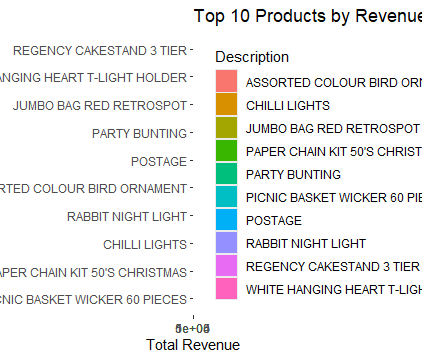

# Project Title 
Customer_Shopping_Behaviour

# Project Overview
This project analyzes customer shopping behaviour using an Online Retail dataset from Kaggle. The goal is to identify key business insights such as top-performing product categories, high-value customers, and spending patterns across countries and gender.

# Tools Used
•	R
•	dplyr: For data manipulation
•	tidyr: For data reshaping 
•	ggplot2: For data visualization

# Data Description 
Source: Online Retail Dataset (CSV from Kaggle)  
The dataset contains 406,829 rows and 12 variables, including:
•	InvoiceNo: Unique transaction ID  
•	StockCode: Product code 
•	Description: Product name 
•	Quantity: Number of items purchased  
•	InvoiceDate: Date and time of purchase
•	UnitPrice: Price per item
•	CustomerID: Unique customer identifier
•	Country: Customer location
•	purchase_amount: Total value of purchase (Quantity × UnitPrice)
•	product_category: Category created from product description
•	gender: Assigned based on CustomerID grouping
•	price_range: Purchase level (Low, Medium, High)

# Data Cleaning
The dataset required cleaning before analysis. Key steps included:
•	Removed missing values from CustomerID and Description 
•	Removed rows with negative quantities 
•	Created new variables: purchase_amount, product_category, gender and price_range 
•	Converted relevant columns to appropriate data types
•	Grouped and summarized data for analysis

# Business Questions
•	Which product category is performing best?
•	Which country has the most profitable customers?
•	Which gender is contributing most to revenue?
•	Are there high-value purchases that require special attention?
•	Recommendations to increase sales and optimize stock and marketing.

# Key Insights 
•	Miscellaneous outperformed other category with a total revenue of (6402352.16)
•	United Kingdom had the most profitable customers with a total revenue of (6767873.39)
•	Female customers recorded a slightly higher average purchase amount per transaction (21.35) compared to male customers.
•	Many high-value purchases fall under the Miscellaneous category due to broad product descriptions not matching predefined keywords.

# Visualization
Charts were created using ggplot2 to show: Product Category vs Total Revenue. Country vs Total Revenue. Gender vs Average Purchase. Top 10 Products by Revenue. Distribution of Purchase Amount

# Conclusion and Recommndation
This analysis demonstrates how data cleaning and exploratory analysis can reveal meaningful business insights.
The Miscellaneous category recorded the highest total revenue. However, this is largely because many products did not match predefined keyword categories and were grouped under Miscellaneous. This suggests that the product categorization method should be improved for more accurate analysis.
The United Kingdom contributed the highest total revenue, making it the most profitable market. The business should prioritize this region through targeted marketing and customer retention strategies.
In terms of customer segments, female customers generated the highest average revenue. This presents an opportunity to design targeted promotions, loyalty programs, and personalized offers to maintain and increase their spending.
The distribution of purchase amounts shows that most transactions are relatively small, while a few purchases are significantly higher. This indicates that although many customers make low-value purchases, a small number of customers contribute disproportionately to total revenue. The business should identify and retain these high-value customers.

Overall, the company should:
•	Improve product categorization for better insights
•	Focus on high-performing markets like the UK
•	Target high-value and high-spending customer segments

# Author
Franklin Chisom  
Data Analyst | Aspiring Data Scientist | R Enthusiast
